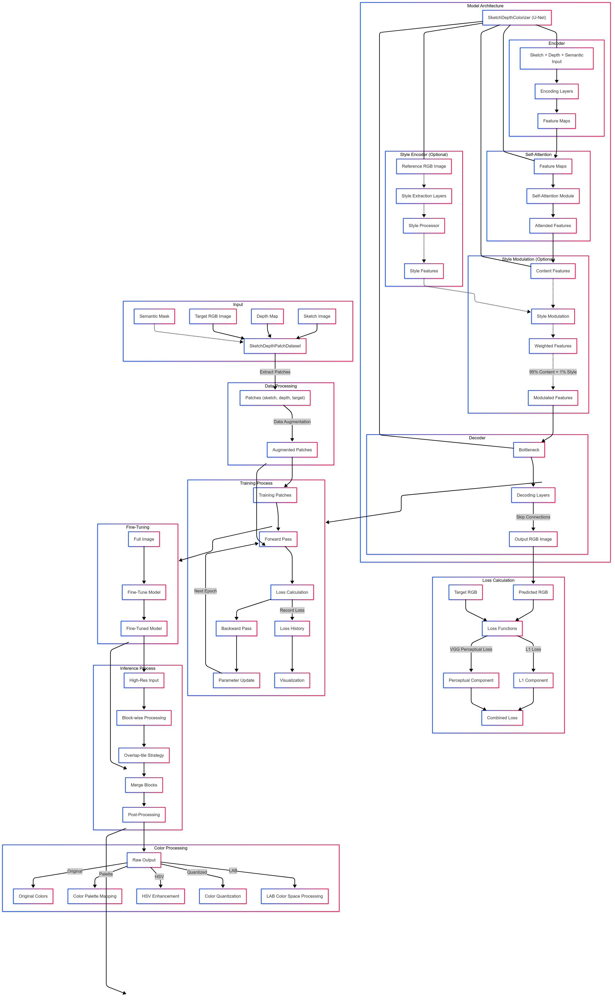

# SemColorNet
**A Single-Image Depth-Aware Colorization Framework Integrating Semantic Segmentation**

---

## 📌 Overview

**SemColorNet** is a lightweight, single-image colorization framework that reconstructs stylistically diverse RGB outputs from sparse architectural inputs—primarily a sketch and an estimated depth map. It optionally incorporates semantic masks and palette guidance to improve structural consistency and regional color modulation.

The model is designed for data-scarce applications such as architectural visualization and heritage restoration, where ground-truth color supervision is limited or absent.

---

## 🧠 Method Summary

### 🔶 Input:
- 🖋️ Sketch
- 🌐 Depth map 
- 🧩 Semantic mask (optional, pre-segmented or SAM-based)
- 🎨 Optional palette configuration (HSV, Lab, fixed or learned)

### 🔶 Output:
- 💡 Stylized RGB image (diverse and semantically coherent)
- Evaluation metrics: SSIM, PSNR

### 🔶 Architecture:
- Backbone: **U-Net** with 3 downsampling and 3 upsampling blocks
- Bottleneck: **Self-Attention**
- Style modulation: Optional **Adaptive Instance Normalization (AdaIN)** or palette-guided
- Loss: **L1 + optional VGG perceptual loss**
- Color space: HSV or Lab (configurable)
- Semantic-aware concatenation (when mask is used)

### 🏗️ Project Architecture



---

## 📁 Directory Structure

```
project/
├── config/
│   └── color_palettes.py              # Defines color palette configurations
│
├── models/
│   ├── attention.py                   # Self-attention module
│   └── unet.py                        # U-Net model architecture
│
├── utils/
│   ├── color_utils.py                 # Functions for color processing
│   ├── image_utils.py                 # General image utility functions
│   ├── lab_processor.py               # LAB color space processing
│   └── visualization.py               # Visualization utilities
│
├── data/
│   └── dataset.py                     # Dataset class definition
│
├── loss/
│   └── combined_loss.py              # Custom loss function definitions
│
├── preprocess/
│   ├── depth-anything-large-hf_6.py  # Depth map generation from RGB
│   ├── SAM_segment_anything_colab.ipynb # Semantic segmentation with SAM
│   ├── sketch_with_cv_0.py           # Sketch image generation
│   ├── depth/                        # Depth map preprocessed outputs
│   ├── multiview/                    # Multiview generation utilities or results
│   ├── semantic/                     # Semantic mask outputs
│   ├── sketch/                       # Sketch map outputs
│   └── view/
│       ├── generate_multiview.py         # Generate multi-view images from depth
│       ├── generate_wiggle_gif.py        # Generate wiggle GIFs for 3D-like effect
│       └── make_multiview.gif.py         # Combine views into a multi-frame GIF
│
├── process/
│   ├── high_res.py                  # High-resolution inference pipeline
│   └── sketch_depth.py              # Sketch and depth generation orchestrator
│
├── train.py                         # Model training entry script
├── process.py                       # Full image inference pipeline
├── batch_process.py                 # Batch processing for multiple inputs
└── generate_styles.py               # Script for stylized image generation
```

---

## 🚀 How to Run

### ✅ Environment Setup

```bash
pip install -r requirements.txt
```

### ✅ Training

Run the training pipeline using the provided script:

```bash
chmod +x train.sh
bash train.sh
```

You can monitor training in terminal using:

```bash
tmux attach -t sketch_train
cat metrics_train/training.log
```

### ✅ Inference (High-Res)

Use the inference script:

```bash
chmod +x process.sh
bash process.sh
```

---

## 📊 Evaluation

Metrics are computed during training and logged:
- **Structural Similarity (SSIM)**
- **Peak Signal-to-Noise Ratio (PSNR)**

Final model achieved:
```
SSIM  = 0.5447
PSNR  = 17.87 dB
```

Trained from a **single image**, with consistent stylization.

---

## 🔍 Training Strategy

- Stage 1: Patch-based training (100 epochs @ 256×256)
- Stage 2: Full-image fine-tuning (50 epochs @ 512×512)
- Loss: L1 + optional VGG (ablation showed VGG hurt PSNR)
- Optimizer: Adam
- Learning rate: Adaptive decay (0.0002 → 0.00001)

Augmentation includes:
- Random crop
- Horizontal/vertical flip
- Rotation
- Color jitter (all applied synchronously on sketch + depth + target canvas)

---

## 🔬 Ablation Summary

| Configuration             | SSIM   | PSNR (dB) |
|--------------------------|--------|-----------|
| Base (Finetuned)         | 0.4087 | 13.69     |
| + Style Encoder (AdaIN)  | 0.5222 | 14.68     |
| + Adaptive LR Decay      | 0.5224 | 15.23     |
| + VGG Perceptual Loss    | 0.5571 | 14.98     |
| ✅ Final (w/o VGG)        | **0.5447** | **17.29**     |

---

## 📷 Sample Results

Sample results can be found under the `/output` directory:

---

## ⚠️ Ethical Considerations

As a generative method, outputs may be misinterpreted as factual. Style bias and visual artifacts may distort structural perception. Use cases should clearly disclose AI generation and treat the model as an assistive tool—not a source of objective truth.

---

## 📚 References

[1] Wang et al., SDE-Net: Sketch-guided Depth-aware Edge-enhanced Network, ECCV 2022  
[2] Shaham et al., SinGAN: Learning a Generative Model from a Single Image, ICCV 2019  
[3] Mildenhall et al., NeRF, ECCV 2020  
[4] Yang et al., NeRFCodec, CVPR 2023

---

## 🏁 Project Author

Rui Luo | u8076655 | [ENGN6528 - Computer Vision, ANU]